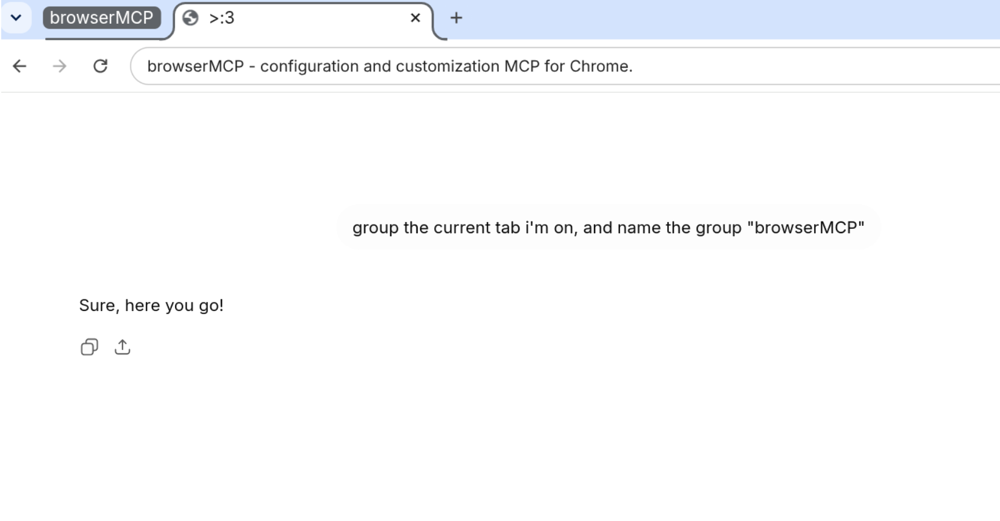

# browserMCP - configuration and customization MCP for Chrome.

A Model Context Protocol server that lets MCP clients easily configure, manage and customize your Chrome browser via an extension.



## Quick install:

```
curl https://raw.githubusercontent.com/MyStuffYT/browserMCP/refs/heads/main/install.py | python3
```

**Note:** This script has not been tested on MacOS or Windows. Please report any issues on the issues tab.

Once you've finished installation and opened your AI coding agent or MCP client, a page should open indicating that your extension has successfully connected with the client!

\>:3